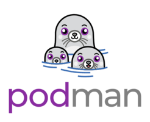
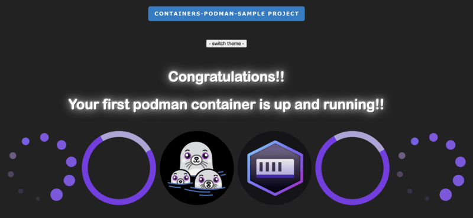

# Podman



## Description
**Sample project to test a podman container.**

---

## Commands

| Description                                         | Command(s)                                                                | Info |
|-----------------------------------------------------|---------------------------------------------------------------------------|------|
| install podman:                                     | brew install podman                                                       |      |
| run podman:                                         | podman machine init                                                       |      |
| start podman:                                       | podman machine start                                                      |      |
| version info:                                       | podman version                                                            |      |
|                                                     |                                                                           |      |
| create podman image:                                | podman build -f Dockerfile.pm --format docker -t vulcanored-pm:latest .   |      |
| create a podman container:                          | podman run -dt -p 9999:80 vulcanored-pm:latest                            |      |
| check running containers:                           | podman ps -a                                                              |      |
| podman search:                                      | podman search: <image_name>                                               |      |
| pull an image from a repository:                    | podman pull docker.io/library/ubuntu                                      |      |
| create and run a container using an image:          | podman run -dt -p 8080:80 docker.io/library/ubuntu                        |      |
| list containers:                                    | podman ps -a                                                              |      |
| stop a running container:                           | podman stop <container_id>                                                |      |
| remove a container:                                 | podman rm <container_id>                                                  |      |
| list locally available images:                      | podman images                                                             |      |
| remove an image:                                    | podman rmi docker.io/library/ubuntu                                       |      |
| information about the Podman installation:          | podman info                                                               |      |
| removes all images:                                 | podman image prune -a                                                     |      |
| podman system prune:                                | removes all stopped containers, all networks, all images, all build cache |      |
| kill all running containers:                        | podman kill $(podman ps -q ) <image_id>                                   |      |
|                                                     |                                                                           |      |
| test the connection, this should return a response: | curl http://localhost:9999                                                |      |
| test localhost in your browser:                     | http://localhost:9999/                                                    |      |
| edit the nginx configuration file                   | nano /etc/nginx/nginx.conf                                                |      |
| test the nginx configuration file                   | nginx -t                                                                  |      |
| nginx restart                                       | nginx -s reload                                                           |      |
| nginx directory                                     | cd /etc/nginx/html                                                        |      |
| location of nginx (error) logs                      | /var/log/nginx/error.log                                                  |      |

---

### get the list of dependent child images

```shell
for i in $(podman-poc images -q)
do
podman-poc history -q $i | grep -q dc6170bc6b8b && podman-poc images | grep $i
done | sort -u
```




```shell
git clone https://github.com/RobertoTorino/podman-sample.git && cd podman-poc-sample/alpine_nginx
```

> **[podman on GitHub click here](https://github.com/containers/podman)**

>             
> **[podman-desktop on GitHub click here](https://github.com/containers/podman-desktop)**

> **[HashNode article ](https://cloudit.hashnode.dev/podman-a-real-docker-alternative)**

